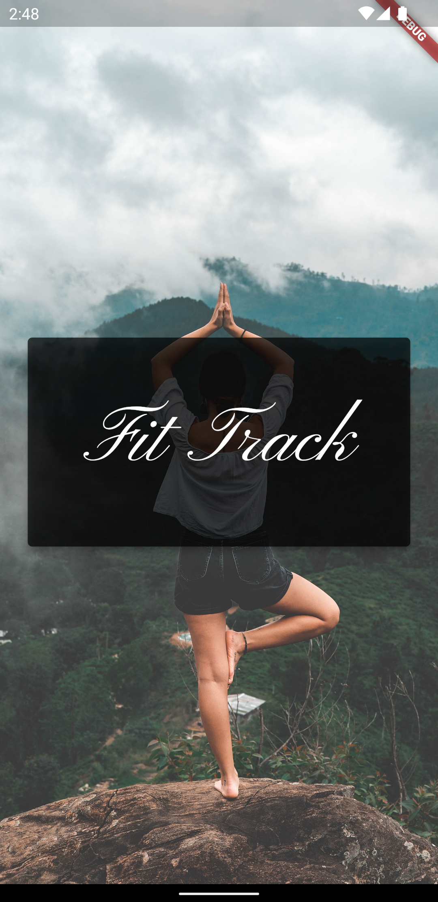
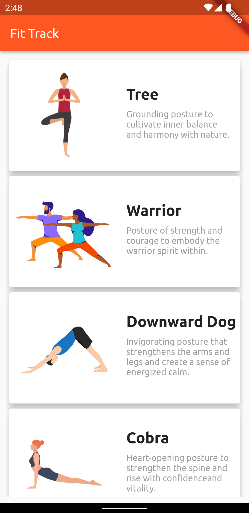
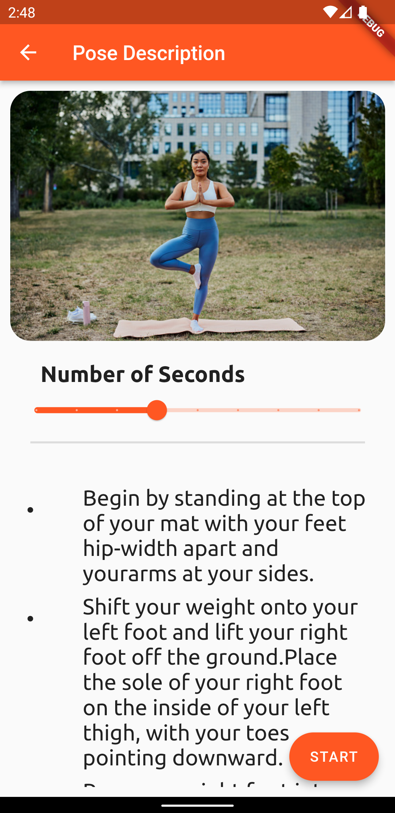

# FitTrack: Real-Time Pose Tracker

<table>
  <tr>
    <td align="center">
      
    </td>
    <td align="center">
      
    </td>
    <td align="center">
      
    </td>
  </tr>
</table>

https://github.com/BalkiratS/fit-track-app/assets/97463574/f5a2ffc9-def2-497f-a33a-735a1ef4e7ae

## Table of Contents

- [Introduction](#introduction)
- [Features](#features)
- [Getting Started](#getting-started)
  - [Prerequisites](#prerequisites)
  - [Installation](#installation)
- [Usage](#usage)
- [How it Works](#how-it-works)
- [APK](#apk)
- [License](#license)

## Introduction

FitTrack is a Flutter-based mobile app designed to help you improve your yoga practice. It uses TensorFlow models to provide real-time feedback on your yoga poses, including Tree and Warrior. FitTrack leverages the front camera to detect and evaluate your pose and displays a checkmark on the screen when you achieve the correct posture.

## Features

- Real-time pose detection using the front camera.
- Evaluation of Tree and Warrior yoga poses.
- Visual feedback with a checkmark display.

## Getting Started

### Prerequisites

Before running the app, make sure you have the following software installed:

- Flutter
- Android Studio or Xcode for iOS development

### Installation

1. Clone the repository:
````git clone https://github.com/yourusername/fit-track-app.git````
3.  Change the working directory:
````cd fit-track-app````
5.  Install dependencies:
````flutter pub get````
7.  Run the app:
````flutter run````


## Usage

1. Open the app on your mobile device.
2. Select the pose you want to practice (Tree or Warrior).
3. Place the device on the floor with your body in the frame.
5. Follow the on-screen instructions and align yourself to achieve the correct yoga pose.
6. The app will provide real-time feedback with a checkmark when you perform the pose correctly.

## How it Works

FitTrack employs a multi-step process to provide real-time feedback on your yoga poses:

1. **Landmark Detection**: The app initiates by leveraging Google's BlazePose technology to detect and capture the landmarks on your body from the feed of the front camera. These landmarks include key points such as the positions of your arms, legs, and torso.

2. **Pose Selection**: You choose the specific yoga pose you want to practice, either the Tree pose or the Warrior pose, within the app.

3. **Pose Detection Models**: FitTrack utilizes TensorFlow models tailored to each selected yoga pose. These models analyze the landmark data provided by BlazePose to evaluate your current pose. The models perform a comprehensive assessment to determine whether your posture aligns with the correct form of the chosen pose.

4. **Real-time Feedback**: Based on the output from the pose detection models, FitTrack offers real-time feedback on your performance. If you are executing the yoga pose correctly, the app displays a checkmark on the screen, providing immediate validation of your form.

By integrating BlazePose and TensorFlow models, FitTrack ensures that you receive accurate feedback on your yoga poses, helping you refine your practice and achieve better results.


## APK

To create an APK for this app, follow these steps:

1. Navigate to the root directory of the project.
2. Run the following command to build the APK:
````flutter build apk````

## License

This project is licensed under the MIT License - see the [LICENSE](LICENSE.txt) file for details.


